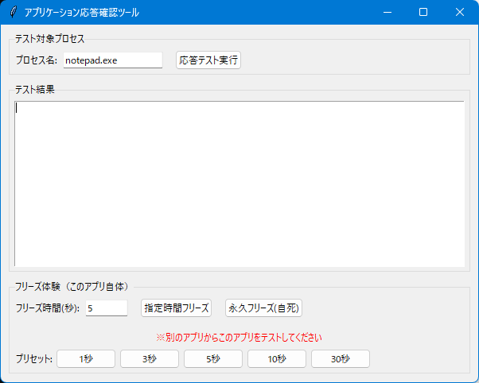

# TA_App_Response_Checker

アプリケーションの応答確認・フリーズ検出ツール

## 🧩 主な機能

- **WM_NULL送信による応答確認** - Windowsシステムレベルでの応答検証
- **フリーズ検出とログ出力** - 応答しないアプリケーションを自動検出
- **リアルタイム応答時間測定** - ミリ秒単位での応答速度測定

## 💻 動作環境

- Python 3.7+
- Windows 10/11
- 必要ライブラリ: psutil, pywin32

## 📦 インストール方法

```bash
# リポジトリをクローン
git clone https://github.com/Li-Wang-Tom/TA_App_Response_Checker.git
cd TA_App_Response_Checker

# 依存関係をインストール
pip install -r requirements.txt

# アプリケーションを起動
python TA_App_Response_Checker.py
```

## 🚀 使用方法

1. **アプリケーションを起動**
2. **検索方法を選択**
   - プロセス名（例: notepad.exe）
   - ウィンドウタイトル（例: メモ帳）
   - Pythonスクリプト（例: my_script.py）
3. **対象を入力して「検索」**
4. **結果リストから選択**
5. **「応答テスト」でフリーズ検出**

## 🖼️ アプリ画面



## 🔧 主な技術

- **WM_NULL メッセージ送信** - Windows API による応答確認
- **SendMessageTimeout** - タイムアウト付きメッセージ送信
- **プロセス監視** - psutil による詳細なプロセス情報取得
- **ウィンドウ検出** - Win32 API によるウィンドウハンドル取得

## 🛠️ 開発者向け情報

### ファイル構成

```
TA_App_Response_Checker/
├─ TA_App_Response_Checker.py         # メインアプリケーション
├─ requirements.txt                   # 依存関係
├─ README.md                          # このファイル
├─ LICENSE                            # ライセンス
├─ Skull_icon.ico                     # アプリケーションアイコン
└─ docs/                              # ドキュメント
   └─ screenshot.png                  # スクリーンショット
```

### 主要クラス・関数

- `PythonScriptDetector` - メインアプリケーションクラス
- `search_python_script()` - Pythonスクリプト検索
- `test_response()` - 応答テスト実行
- `get_process_windows()` - プロセスのウィンドウ取得

## 🤝 貢献方法

1. フォークしてください
2. フィーチャーブランチを作成（`git checkout -b feature/amazing-feature`）
3. 変更をコミット（`git commit -m 'Add amazing feature'`）
4. ブランチにプッシュ（`git push origin feature/amazing-feature`）
5. プルリクエストを作成

## 📝 License

This project is licensed under the MIT License.  
See the [LICENSE](LICENSE) file for details.

## 👨‍💻 作者

**TA Li-Wang-Tom**

- GitHub: [@Li-Wang-Tom](https://github.com/Li-Wang-Tom)

## 🙏 謝辞

このプロジェクトは Windows API と Python コミュニティの優れたライブラリを活用しています。

本项目的开发离不开以下优秀的开源项目和社区支持：

- **Python 社区** - 为我们提供了强大的编程语言
- **psutil 开发团队** - 提供了优秀的系统监控库
- **pywin32 项目** - 让Python能够调用Windows API
- **GitHub** - 为开源项目提供了完美的托管平台
- **Stack Overflow 社区** - 在开发过程中提供了无数帮助

感谢所有为开源事业贡献力量的开发者们！

没有你们的努力，就没有这个项目的诞生。

谢谢大家！🎉